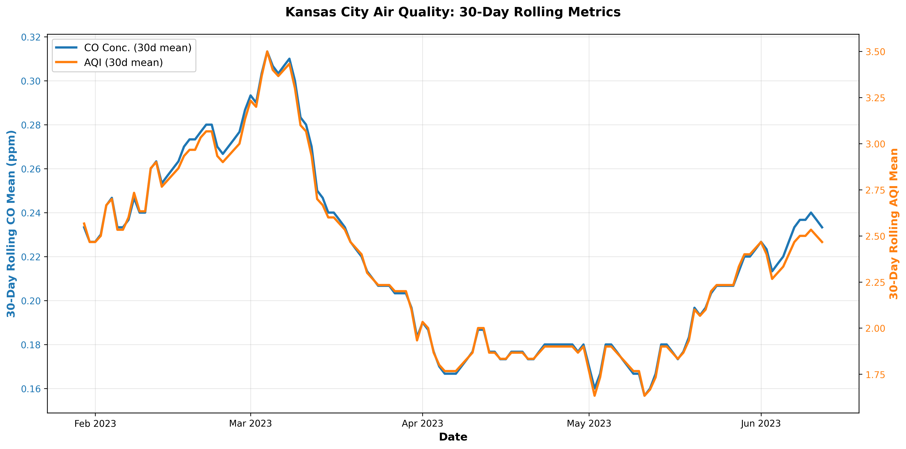
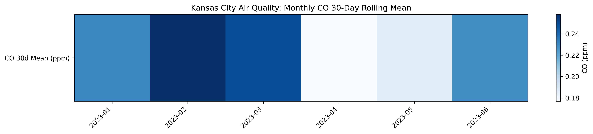
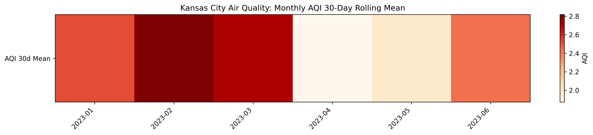

# Continuous Intelligence

This site provides documentation for this project.
Use the navigation to explore module-specific materials.

## How-To Guide

Many instructions are common to all our projects.

See
[⭐ **Workflow: Apply Example**](https://denisecase.github.io/pro-analytics-02/workflow-b-apply-example-project/)
to get these projects running on your machine.

## Project Documentation Pages (docs/)

- **Home** - this documentation landing page
- **Project Instructions** - instructions specific to this module
- **Your Files** - how to copy the example and create your version
- **Glossary** - project terms and concepts

## Additional Resources

- [Suggested Datasets](https://denisecase.github.io/pro-analytics-02/reference/datasets/cintel/)

## Custom Project

### Air Quality Analysis - Kansas City 2023

This project includes an analysis of Kansas City air quality data from the first half of 2023, focusing on rolling metrics for carbon monoxide (CO) and the Air Quality Index (AQI).

#### Dataset

**Source:** `data/kc_air_co_data_2023.csv`

Daily air quality observations for Kansas City, MO-KS including:

- **Daily Max 8-hour CO Concentration** (ppm) - Carbon monoxide measurement
- **Daily AQI Value** - Overall air quality index
- **Daily Obs Count** - Number of observations per day
- **Percent Complete** - Data completeness indicator

The dataset contains 148 records, representing daily monitoring points.

#### Signals (Rolling Metrics)

Two 30-day rolling metrics were computed to smooth daily variation and reveal trends:

1. **30-Day Rolling CO Mean** (`co_rolling_30d_mean`)
   - Average of the most recent 30 daily max 8-hour CO concentrations
   - Units: ppm (parts per million)
   - Reveals baseline CO exposure trends; rising values indicate worsening air quality from CO

2. **30-Day Rolling AQI Mean** (`aqi_rolling_30d_mean`)
   - Average of the most recent 30 daily AQI values
   - Dimensionless index (typically 0-500+)
   - Provides overall health-facing air quality trend; integrates effects of all pollutants

#### Results

- **Strong correlation:** CO and AQI trends track closely together, indicating CO is a significant driver of KC's overall AQI
- **Seasonal pattern:** Clear degradation Feb-Mar 2023 (winter), improvement Apr-Aug 2023 (spring/summer), slight worsening toward year-end

### Experiments

- I first tried a 30-day rolling exceedance count for AQI > 50 and it did not return any valuable insights for this dataset, so I switched it up to use the AQI rolling mean.
- Regarding the dataset:  It was missing rows (dates), so I added in some sample data to fill those gaps.

#### Visualization

A dual-axis line chart displays both metrics together:

- **Blue line (left Y-axis):** 30-day rolling CO mean (ppm)
- **Orange line (right Y-axis):** 30-day rolling AQI mean
- **X-axis:** The listed months of 2023 labeled

Outputs:

- Static PNG: `artifacts/air_quality_rolling_chart.png`


#### Code

**Pipeline script:** `src/cintel/rolling_monitor_dawson_air_quality.py`

- Reads air quality CSV
- Parses and sorts by date
- Computes 30-day rolling means for CO and AQI
- Outputs: `artifacts/air_quality_rolling_metrics.csv`

**Visualization script:** `src/cintel/visualize_air_quality.py`




- Reads the rolling metrics artifact
- Generates dual-axis matplotlib chart (PNG)

#### How to Run

```bash
# Generate rolling metrics
uv run python -m cintel.rolling_monitor_dawson_air_quality

# Create visualizations
uv run python -m cintel.visualize_air_quality
```

### Interpretation

- This will help my system detect changes in air quality looking at a 30 day rolling window.
- The two metrics track together closely, indicating that CO concentration is a strong driver of the overall AQI.
- Feb-Mar 2023 showed peak degradation.

---
